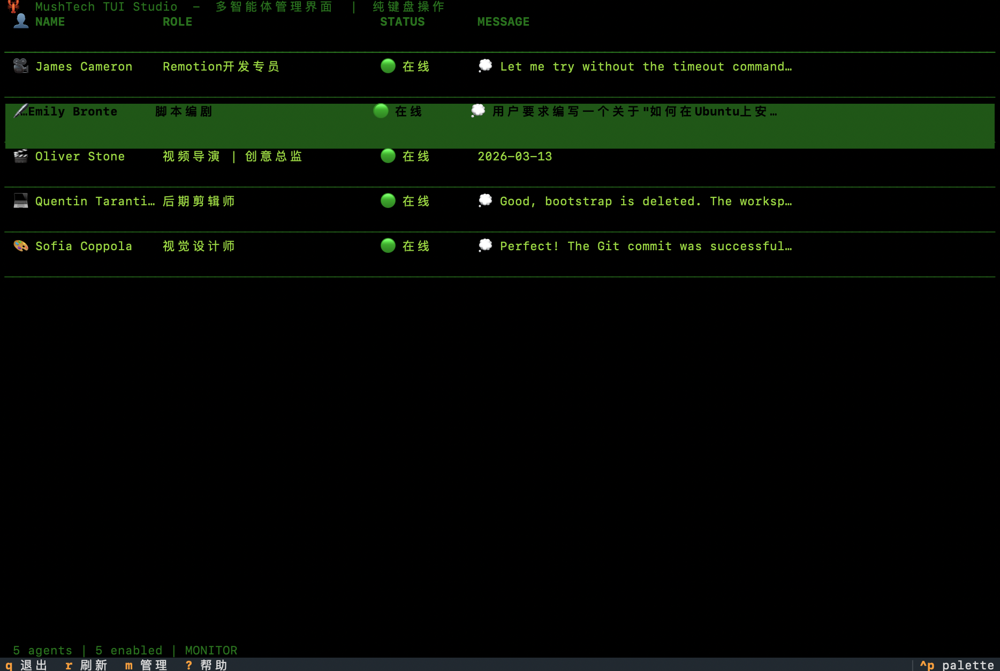
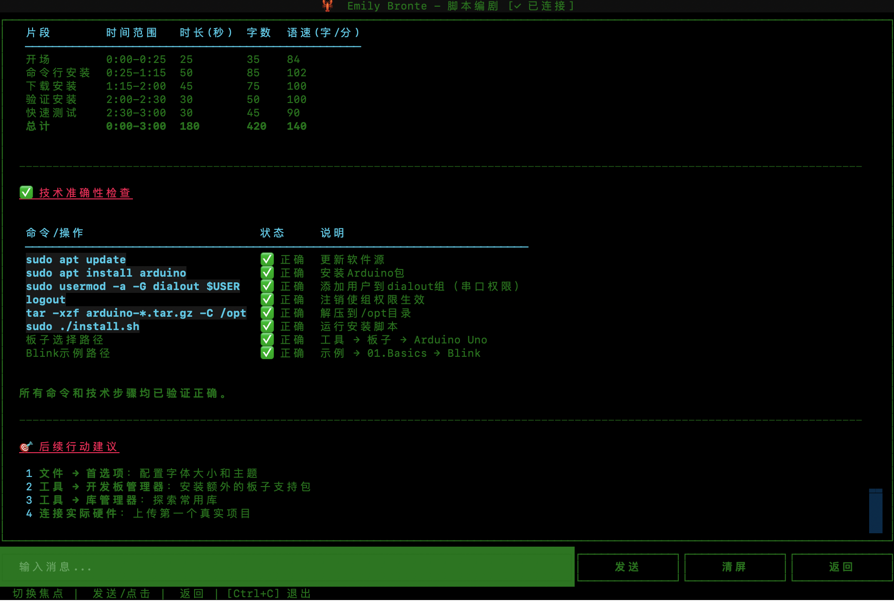
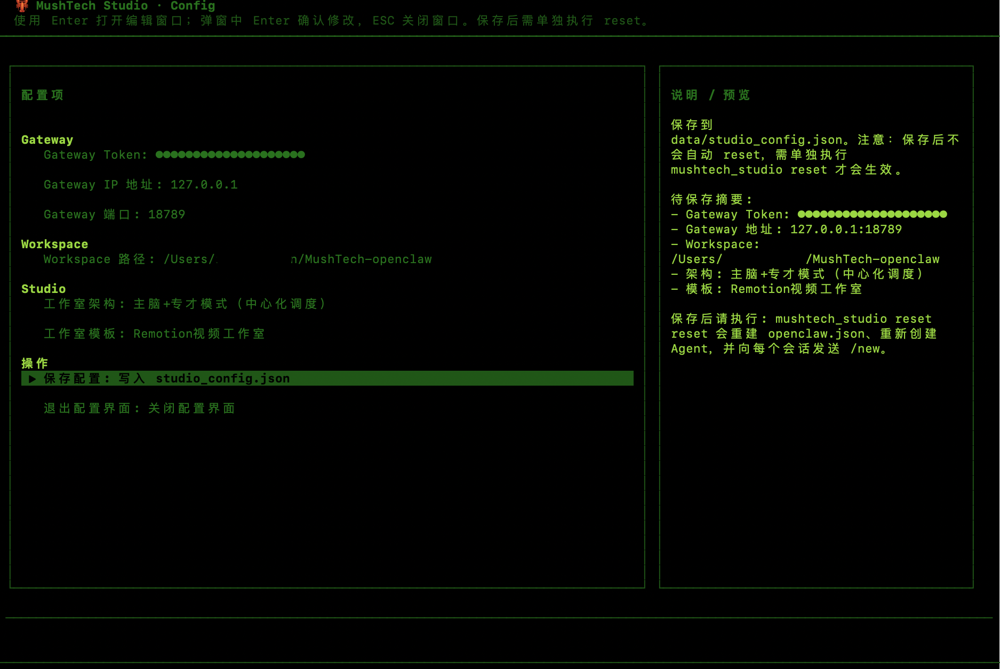

# 🦞 MultiAgentStudio（MushTech TUI Studio）

<p align="center">
  <strong>基于 OpenClaw 的多智能体代码外包团队 TUI 管理工具</strong><br>
  <em>纯键盘驱动的终端应用，用于管理多智能体团队并与 Gateway 进行 WebSocket 通信</em>
</p>

<p align="center">
  
  
  
</p>

---

## 📖 项目介绍

**MultiAgentStudio**（又称 **MushTech TUI Studio**）是一个基于 [OpenClaw](https://github.com/mushtech-ai/openclaw) 的多智能体团队管理终端应用。它提供了一个纯键盘驱动的 TUI（Text User Interface）界面，让你可以在终端中轻松管理一支由 AI 智能体组成的开发团队。

### 与 OpenClaw 的关系

- **OpenClaw** 是 MushTech 推出的 AI 智能体框架和 Gateway 服务，提供了多智能体的底层能力
- **MultiAgentStudio** 是 OpenClaw 的 **TUI 客户端**，提供了可视化的管理界面
- 通过本工具，你可以：
  - 可视化配置和管理 OpenClaw Gateway 连接
  - 创建、删除、编辑智能体（Agents）
  - 与多个智能体进行实时对话
  - 监控智能体的工作状态和消息

---

## ✨ 核心功能

### 🎯 多智能体管理
- **智能体列表**：一览所有团队成员的状态和最近消息
- **增删改查**：添加新员工、删除、编辑智能体配置
- **实时状态监控**：在线/离线/工作中状态一目了然
- **未读消息提醒**：卡片边框变色 + 数字徽章提醒

### 💬 智能聊天系统
- **多会话隔离**：每个智能体拥有独立的会话上下文
- **实时消息**：发送后立即显示，AI 回复自动刷新
- **消息持久化**：退出后消息历史保留，随时恢复对话
- **思考状态提示**：显示 AI 正在处理的动画状态

### ⚙️ 配置管理
- **Gateway 配置**：设置连接地址、Token、端口
- **工作区配置**：自定义项目工作目录
- **架构选择**：支持主脑+专才模式（混合架构）
- **模板系统**：内置 Remotion 视频工作室、软件工程、股票分析等模板

### 🎨 模板系统
预置多种团队配置模板：
- **Remotion 视频工作室**：视频导演、脚本编剧、视觉设计师、后期剪辑师、Remotion开发专员
- **软件工程团队**：产品经理、UI设计师、程序员、测试工程师、文档工程师
- **股票分析团队**：策略分析师、技术分析师、基本面分析师、风险评估师

---

## 🖼️ 界面预览

### 🎛️ 监控看板（主界面）
显示所有智能体的工作状态、最新消息、在线情况，纯键盘导航操作。

<p align="center">
  
</p>

### 💬 聊天界面
与单个智能体进行深入对话，支持发送消息、清屏、返回等操作。

<p align="center">
  
</p>

### ⚙️ 设置界面
配置 Gateway 连接参数、工作区路径、工作室架构和模板。

<p align="center">
  
</p>

---

## 🏗️ 项目结构

```
openclaw-tui-studio/
├── mushtech_studio/            # 主程序包
│   ├── __init__.py             # 包入口
│   ├── __main__.py             # python -m 入口
│   ├── app.py                  # 主应用（员工网格、未读提醒、导航）
│   ├── models.py               # 数据模型（Employee、MultiAgentConfig）
│   ├── client.py               # WebSocket 客户端（多智能体会话隔离）
│   ├── chat_screen.py          # 聊天界面（即时消息显示）
│   ├── agent_management_screen.py  # 智能体管理界面（增删改查）
│   ├── config_screen.py        # 配置界面
│   ├── config_manager.py       # 配置管理器
│   ├── message_manager.py      # 全局消息管理器
│   ├── cmd_executor.py         # MushTech CMD 命令执行器
│   ├── logger.py               # 日志模块
│   ├── cli.py                  # 命令行接口
│   └── templates/              # 团队模板
│       ├── __init__.py
│       ├── base.py             # 基础模板类
│       ├── remotion_video.py   # Remotion视频工作室模板
│       ├── software_engineering.py  # 软件工程团队模板
│       └── stock_analysis.py   # 股票分析团队模板
│
├── scripts/                    # 辅助脚本
│   └── setup_mushtech_team.py  # 初始化团队脚本
│
├── data/                       # 数据存储
│   ├── employees.json          # 员工数据存储
│   ├── messages_*.jsonl        # 各智能体消息历史
│   ├── multi_agent_config.json # 多智能体配置
│   ├── studio_config.json      # 工作室配置
│   └── identities/             # 员工身份密钥（Ed25519）
│
├── logs/                       # 运行日志
│   └── mushtech_*.log          # 应用日志文件
│
├── images/                     # 截图资源
│   ├── UI_MAIN.png             # 监控看板截图
│   ├── UI_CHAT.png             # 聊天界面截图
│   └── UI_CONFIG.png           # 设置界面截图
│
├── run.sh                      # 启动脚本
├── README.md                   # 项目说明
└── LICENSE                     # 许可证
```

---

## 🌟 特色亮点

### 1. 🎮 纯键盘操作
- 无需鼠标，完全使用键盘导航
- Vim 风格快捷键支持
- 高效的快捷键系统

### 2. 🧠 混合架构支持
采用 **主脑+专才模式**（生产级推荐）：

```
用户请求
    ↓
🎯 主脑（Product Manager）
    ↓ agentToAgent 通信
├───├───├───├───┐
◇       ◇       ◇       ◇
🎨    💻    🧪    📝
UI     开发    测试    文档
设计师 工程师  工程师  工程师
```

### 3. 🔐 会话隔离
- 每个智能体独立的 session_key（格式：`agent:<id>:main`）
- 完全独立的对话历史和上下文
- 工作区隔离：每个智能体有自己的工作目录

### 4. 🔄 Agent 间通信
- 支持 `agentToAgent` 通信
- 主脑可以向专才分派任务
- 协作完成复杂项目

### 5. 💾 数据持久化
- 消息历史自动保存到本地
- 配置自动同步
- 支持配置导入导出

### 6. 🚀 后台连接
- 即使退出聊天界面，WebSocket 连接保持
- 消息持续接收，下次进入时显示
- 未读消息自动提醒

---

## 📋 必要条件

### 系统要求
- **操作系统**: macOS / Linux / Windows (WSL)
- **Python**: 3.8 或更高版本
- **Node.js**: 16.x 或更高版本（用于 OpenClaw CLI）

### 前置依赖
1. **OpenClaw CLI** - 智能体管理命令行工具
2. **OpenClaw Gateway** - 本地或远程 Gateway 服务

---

## 🚀 部署步骤

### 1. 安装 OpenClaw CLI

```bash
# 安装 OpenClaw CLI
npm install -g @openclaw/cli

# 验证安装
openclaw --version
```

### 2. 克隆项目并安装依赖

```bash
# 克隆项目
git clone https://github.com/devinzhang91/MultiAgentStudio.git
cd MultiAgentStudio

# 创建 Python 虚拟环境
python3 -m venv .venv
source .venv/bin/activate  # Linux/Mac
# 或 .venv\Scripts\activate  # Windows

# 安装 Python 依赖
pip install textual aiohttp cryptography
```

### 3. 配置 Gateway

确保你有一个运行的 OpenClaw Gateway，获取以下信息：
- Gateway URL（如：`http://127.0.0.1:18789`）
- Gateway Token（认证令牌）

### 4. 初始化团队（可选）

```bash
# 使用脚本初始化默认团队
python3 scripts/setup_mushtech_team.py
```

---

## 🎮 使用方法

### 启动应用

```bash
# 方式1：使用启动脚本
./run.sh

# 方式2：直接运行
python3 -m mushtech_studio

# 方式3：作为模块运行
python3 mushtech_studio/app.py
```

### 主界面操作

| 按键 | 功能 |
|------|------|
| `↑↓←→` | 导航选择员工卡片 |
| `Enter` | 打开选中员工的聊天界面 |
| `a` | 添加新员工 |
| `d` | 删除选中员工 |
| `m` | 打开智能体管理界面 |
| `c` | 显示/隐藏配置面板 |
| `r` | 刷新列表 |
| `q` | 退出应用 |
| `?` | 显示帮助 |

### 聊天界面操作

| 按键 | 功能 |
|------|------|
| `Enter` | 发送消息 |
| `Tab` | 切换焦点（输入框/按钮） |
| `Shift+Tab` | 反向切换焦点 |
| `ESC` | 返回主界面 |
| `Ctrl+C` | 退出应用 |

### 配置界面操作

| 按键 | 功能 |
|------|------|
| `↑↓` | 选择配置项 |
| `Enter` | 编辑选中项 |
| `S` | 保存配置 |
| `ESC` | 退出配置界面 |

### 智能体管理界面操作

| 按键 | 功能 |
|------|------|
| `↑↓` | 在列表中上下移动 |
| `→` / `Enter` | 从列表进入配置面板 |
| `←` | 从配置面板返回列表 |
| `A` | 添加新智能体 |
| `S` | 保存当前配置 |
| `D` | 删除当前智能体 |
| `R` | 刷新列表 |
| `ESC` | 返回主界面 |

---

## ⚙️ 配置说明

### 配置文件位置

- **工作室配置**: `data/studio_config.json`
- **员工数据**: `data/employees.json`
- **多智能体配置**: `data/multi_agent_config.json`
- **消息历史**: `data/messages_<agent_id>.jsonl`

### 配置示例

```json
// data/studio_config.json
{
  "gateway_url": "http://127.0.0.1:18789",
  "gateway_token": "your-token-here",
  "architecture": "hybrid",
  "studio_type": "remotion_video",
  "base_workspace": "/path/to/workspace"
}
```

### 重置配置

```bash
# 重置工作室（会重建配置、重新创建 Agents）
python3 -m mushtech_studio reset
```

---

## 🔧 开发指南

### 运行测试

```bash
# 语法检查
python3 -m py_compile mushtech_studio/*.py

# 导入测试
python3 -c "from mushtech_studio.models import Employee; print('OK')"
```

### 查看日志

```bash
# 实时查看日志
tail -f logs/mushtech_*.log
```

---

## 📝 多智能体架构详解

### 会话隔离机制

每个智能体有独立的会话键：

```
agent:product-manager:main
agent:ui-designer:main
agent:programmer:main
agent:code-tester:main
agent:document-writer:main
```

这确保了：
- ✅ 完全独立的对话历史
- ✅ 完全独立的上下文
- ✅ 完全独立的状态

### 工作区隔离

```
~/.openclaw/MushTech/
├── workspace-product-manager/    # 主脑独立工作区
├── workspace-ui-team/            # UI团队工作区
├── workspace-dev-team/           # 开发团队工作区
├── workspace-qa-team/            # 测试团队工作区
└── workspace-doc-team/           # 文档团队工作区

~/.openclaw/agents/
├── product-manager/agent/        # 主脑独立 agentDir
├── ui-designer/agent/            # UI独立 agentDir
├── programmer/agent/             # 开发独立 agentDir
├── code-tester/agent/            # 测试独立 agentDir
└── document-writer/agent/        # 文档独立 agentDir
```

---

## 📚 参考文档

- [OpenClaw 官方文档](https://docs.mushtech.ai/zh-CN/concepts/multi-agent)
- [OpenClaw Session 管理](https://docs.mushtech.ai/zh-CN/concepts/session)
- [Textual 文档](https://textual.textualize.io/) - TUI 框架

---

## 🤝 贡献指南

欢迎提交 Issue 和 Pull Request！

1. Fork 本仓库
2. 创建你的 Feature Branch (`git checkout -b feature/AmazingFeature`)
3. 提交你的更改 (`git commit -m 'Add some AmazingFeature'`)
4. 推送到 Branch (`git push origin feature/AmazingFeature`)
5. 打开一个 Pull Request

---

## 📄 许可证

本项目采用 [MIT](LICENSE) 许可证。

---

<p align="center">
  Made with ❤️ by <a href="https://github.com/devinzhang91">devinzhang91</a>
</p>
